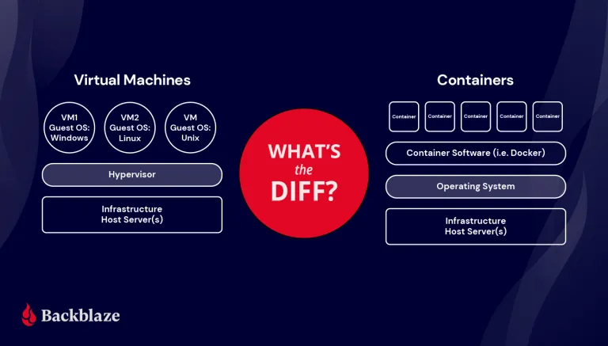

# 4. Contenedores con Docker

### 4.1.1 Definición de contenedores

Los contenedores son una forma de empaquetar, distribuir e implementar aplicaciones de software de forma rápida y eficiente. 

Un contenedor es una unidad de software que empaqueta una aplicación y todas sus dependencias, de modo que la aplicación se pueda ejecutar de forma fiable y rápida en cualquier entorno. Los contenedores aíslan el software de su entorno y garantizan que funcione de la misma manera en cualquier lugar.

Los contenedores son una solución ligera y portátil que hace que el desarrollo, la implementación y la administración de aplicaciones sean más rápidos y fáciles. Los contenedores son ideales para aplicaciones y servicios basados en microservicios, ya que permiten a los equipos de desarrollo dividir las aplicaciones en componentes más pequeños y fáciles de gestionar.

Para conocer un poco más sobre los contenedores y su historia, les recomiendo una conferencia donde se explica la historia de los contenedores y su evolución. [Conferencia](https://www.youtube.com/watch?v=cUygIN0MRUc&t=1566s)

### 4.1.2 Comparación con máquinas virtuales

Los contenedores son similares a las máquinas virtuales, pero son más ligeros y portátiles. Mientras que las máquinas virtuales emulan hardware físico, los contenedores emulan el sistema operativo del host. Esto significa que los contenedores virtualizan el sistema operativo, pero no el hardware subyacente.

En esta imagen podemos ver la diferencia entre una máquina virtual y un contenedor. 

En la máquina virtual, cada máquina virtual tiene su propio sistema operativo y su propia copia de la aplicación, todo esto a nivel de hardware. Esto nos permite tener varias sistemas operativos en un mismo hardware físico, pero con mayor consumo de recursos que quiza no se estén utilizando.

En el contenedor, estos son levantandos en un mismo sistema operativo, compartiendo el kernel del sistema operativo, lo que permite que los contenedores sean más ligeros y portátiles que las máquinas virtuales. Cada uno de los contenedores tiene su propia copia de la aplicación y sus dependencias, pero comparten el sistema operativo del host.

### 4.1.3 Beneficios de los contenedores

Con lo anterior, podemos ver que los contenedores tienen varias ventajas y beneficios sobre las máquinas virtuales y en general sobre la virtualización de sistemas. Algunos de estos beneficios son:

1. **Reduce los recursos de administración de IT**
2. **Tamaño reducido lo que permite mayor densidad**
3. **Reduce y simplifica las actualizaciones seguras**
4. **Agilidad tanto en desarollo como en producción**

## 4.2. Instalación y configuración de Docker

### 4.2.1 ¿Qué es Docker?

Docker es una plataforma de código abierto que permite a los desarrolladores empaquetar, distribuir y ejecutar aplicaciones en contenedores. Los contenedores son unidades de software que empaquetan una aplicación y todas sus dependencias, de modo que la aplicación se pueda ejecutar de forma fiable y rápida en cualquier entorno.

Docker fue lanzado en 2013 y desde entonces se ha convertido en una de las herramientas de desarrollo más populares. Docker es una solución ligera y portátil que hace que el desarrollo, la implementación y la administración de aplicaciones sean más rápidos y fáciles.

Docker no solo se encarga de la creación de contenedores, sino que viene con una serie de herramientas para el manejo de imagenes, red, volumentes, entre otros.

Tomar en cuenta que docker no es el único software que permite la creación de contenedores, pero es el más popular y el que se ha convertido en el estándar de facto en la industria. Existen otras alternativas como Podman, LXC, LXD, entre otros.

Este es el [enlace](https://www.docker.com/) de la **página oficial** de Docker.

### 4.2.2 Instalación de Docker Linux

Para instalar Docker en Linux, se recomienda seguir la documentación oficial de Docker, ya que la instalación puede variar dependiendo de la distribución de Linux que se esté utilizando.

Platform |	x86_64 / amd64
------------ | -------------
[Ubuntu](https://docs.docker.com/engine/install/ubuntu/)	 |✅
Debian	|✅
Red Hat Enterprise Linux (RHEL) |	✅
[Fedora](https://docs.docker.com/desktop/install/fedora/)	| ✅

### 4.2.3 Instalación de Docker Windows

Para instalar Docker en Windows, como tal no se instala Docker en Windows, sino que se instala Docker Desktop, que es una aplicación que permite a los desarrolladores empaquetar, distribuir y ejecutar aplicaciones en contenedores. Docker Desktop es instalar WSL 2 (Windows Subsystem for Linux) y Docker Engine.

## 4.3. Explicación del Docker Engine

### 4.3.1 Arquitectura del Docker Engine

El Docker Engine es una aplicación cliente-servidor con estos componentes:

- Un servidor que es un tipo de demonio que se ejecuta en la máquina host.
- Una API REST que especifica interfaces que los programas pueden usar para hablar con el demonio y darle instrucciones.

**¿Qué es un Deamon (demonio)?**

Un demonio es un programa que se ejecuta en segundo plano, sin interacción directa con el usuario. Los demonios se utilizan para realizar tareas de mantenimiento y administración del sistema, como la gestión de servicios, la programación de tareas y la monitorización del sistema.

En el caso de Docker, el demonio es el servidor de Docker que se ejecuta en la máquina host y se encarga de gestionar los contenedores y las imágenes de Docker.

### 4.3.2 Ciclo de vida de un contenedor

El ciclo de vida de un contenedor es administrado por un runtime de contenedores, que es un software que se encarga de ejecutar y gestionar los contenedores. Docker utiliza un runtime de contenedores llamado containerd, que es un proyecto de código abierto que proporciona una API para la gestión de contenedores.

El ciclo de vida de un contenedor consta de los siguientes pasos:

1. **Creación**: En este paso, se crea un contenedor a partir de una imagen de Docker. Una imagen de Docker es un paquete de software que contiene una aplicación y todas sus dependencias. 

2. **Inicio**: En este paso, se inicia el contenedor y se ejecuta la aplicación que contiene. 

3. **Ejecución**: En este paso, se ejecuta la aplicación que contiene el contenedor. 

4. **Detención**: En este paso, se detiene el contenedor y se detiene la aplicación que contiene.

### 4.3.3 Imágenes y contenedores

### 4.3.4 Comandos de Docker

## 4.4. Dockerfile y Multistages

### 4.4.1 ¿Qué es un Dockerfile?

### 4.4.2 Sintaxis y estructura de un Dockerfile

### 4.4.3 Multistage Builds

## 4.5. Network y volumenes de contenedores

### 4.5.1 Redes en Docker

### 4.5.2 Volumenes en Docker

### 4.5.3 Comandos de Docker Network y Docker Volumes

## 4.6. Docker Compose

### 4.6.1 ¿Qué es Docker Compose?

### 4.6.2 Sintaxis y estructura de un archivo docker-compose.yml

### 4.6.3 Comandos de Docker Compose